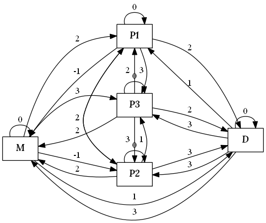

import ImagePreview from "../../../src/components/ImagePreview.js";
import advancedGraph from "./AdvancedGraph.png";

#### חידה:

אני ו-$n$ פינגוויני בחדר. זה לא חדר נחמד בכלל ואני ממש ממש לא רוצה להישאר בו או להשאיר פינגווינים תמימים בו. אבל יש בעיה: הפינגווינים העצלנים לא רוצים לזוז, והיציאה היחידה מהחדר היא דרך דלת, שמקושרת לשעון, והשעון לא מחכה לאף פינגווין עצל.  


עכשיו מגיעים לנתונים שמתקיימים באורח פלא, ולא סביר שנפגוש אותם במציאות:

1. הזמן שלוקח לי להגיע ממקום א׳ למקום ב׳ הוא לא סימטרי. **דוגמה:** ללכת לפינגווין מס׳ 1 מנקודת הפתיחה לוקחת 3 יחידות זמן, אך חזרה מפינגווין מס׳ 1 לנקודת הפתיחה יכולה לקחת 5 יחידות זמן. למה? ככה, זה הופך את החידה למעניינת.
2. יש מסלולים מסוימים שמעבר בהם מוסיף זמן לשעון. **דוגמה:** מעבר מהמיקום ההתחלתי אל הדלת, תוסיף 2 יחידות זמן לשעון. למה? נראה לי שכבר הבנתם.

אלה נתונים שדווקא יכול להתקיים במציאות:

3. יש לי במקסימום 5 פינגווינים. איך זה עוזר לנו? נגלה בהמשך.
4. הדלת פתוחה כל עוד השעון מראה זמן גדול שווה ל-0. זאת אומרת שאם הדלת כבר נסגרה כי השעון הגיע למינוס אחת, אבל עברנו במסלול כלשהו שהביא לנו עוד זמן והעלה את השעון ל-0 או יותר, הדלת תפתח שוב.

כמו כן, באורח פלא יש לי מחשב (לא המחשב הכי חזק בעולם, אבל הוא יכול להריץ כרום עם 30 טאבים בלי למות, וזה מספיק טוב). ובאורח פלא 2, אני יכולה לקחת פסק זמן ארוך כרצוני לפני כל הסיפור הזה, בשביל לתכנן אסטרטגיה טובה. מהי אסטרטגיה טובה? כזאת שתאפשר לי להציל כמה שיותר פינגווינים, בלי להיסגר בחדר לנצח (כי מה יעזור להוציא את הפינגווינים אם אף אחת לא תדאג להם שם בחוץ?), אם אני מגיעה לדלת כשהשעון מראה 0 זה מספיק טוב, ואני עדיין אוכל להימלט.

עד פה החידה.
בואו ננסה להבין איך נמצא אסטרטגיה טובה. אציין שעוד לא פתרתי את החידה ואני כותבת תוך כדי מהלך הפתרון שלה.
נרצה לכתוב פונקציה `getBestPath` המקבלת שני פרמטרים:
הראשון, מטריצה בשם `times` שמימדיה $(n+2)\times(n+2)$. המטריצה תגיע בפורמט הבא:
`times[i][j]`שווה לזמן שיקח לי להגיע מנקודה $i$ לנקודה $j$. הנקודות הן: נקודת ההתחלה, פינגווין 1, $...$, פינגווין $n$, דלת.

הפרמטר השני הוא מספר לא שלילי `timeLimit` שאומר כמה יחידות זמן מראה השעון בהתחלה.

לאורך המאמר נשתמש, באופן שרירותי, במטריצה הבאה:

$$
\begin{pmatrix}
0 & 1 & 2 & 1 & -1 \\
2 & 0 & 3 & 2 & 3 \\
2 & 2 & 0 & 3 & 2 \\
3 & 3 & 2 & 0 & 1 \\
2 & 1 & 1 & 1 & 0
\end{pmatrix}
$$

אני אסביר מה נובע מהמטריצה הזאת. בגלל שמימדיה הם 5 שורות על 5 עמודות, נובע שיש סה"כ 3 פינגווינים, כי השורה והעמודה הראשונה מייצגות את נקודת ההתחלה והשורה והעמודה האחרונה מייצגות את הדלת. גם נובע שמעבר מפינגווין מס' 2 לפינגווין מס' 3 לוקח 2 יחידות זמן (שורה שלישית, עמודה רביעית), ומעבר מהדלת לפינגווין מס' 2 מוסיף 1 יחידות זמן (שורה ראשונה, עמודה שלישית).

לי זו נראית כמו חידת גרפים קלאסית.
הגרף שלנו הוא **גרף מכוון** שבו לכל קשת משקל שלם (יכול להיות שלילי).
הצמתים הם: נקודת ההתחלה, צומת לכל פינגווין והדלת. נסמן אותם ב-$\{M,P1, …,Pn,D\}$. $M$ היא נקודת ההתחלה, $P1$ הוא צומת הפינגווין הראשון, $P2$ השני, וכך עד $Pn$ ו-$D$ היא הדלת.
בין כל צומת יש קשת (הגרף הוא **גרף שלם**) שמשקלה נגזר מהמטריצה `times`. כדוגמה, בהנחה שהמטריצה בגודל $5\times 5$, המשקל של הקשת שמחברת בין פינגווין מס׳ 2 לדלת יהיה הערך `times[2][4]`.

הגרף שמתואר במטריצה שלמעלה נראה ככה:


אנחנו רוצים למצוא מסלול ש:

1. יתחיל בנקודת ההתחלה.
1. יעבור בכמה שיותר מצמתי הפינגווינים.
1. יסיים בדלת.
1. אורך המסלול (סכום משקלי הקשתות המרכיבות את המסלול) יהיה קטן או שווה לזמן ההתחלתי,`timeLimit`.

קל. סתם, לא באמת קל.
למעשה זה מרגיש לי כל כך לא קל, שאני אציע כפתרון אפשרי אחד בסיבוכיות מטורפת.  
יש המון אלגוריתמים ידועים למציאת מסלולים קצרים בגרף. הבעיה היא שאנחנו רוצים למקסם את כמות צמתי הפינגווין שנעבור בהם.  
בשביל שנדע באילו מצמתי הפינגווינים כבר עברנו, נצטרך לשלב אלמנט של זכרון בגרף. נוסיף כמה שכבות לגרף (ז"א, נשכפל את הצמתים כמה פעמים) וכל שכבה כזו תסמל מצב שבו עברנו כבר בצמתי פינגווינים כלשהם. אני אסביר.  

אנחנו הולכים לשכפל את הצמתים מהגרף המקורי. כל שכפול כזה יקרא "שכבה" ויהיה כנגד תת-קבוצה של $P$ (קבוצת כל צמתי הפינגווין). כדוגמה, אם אנחנו בצומת $D$ בשכבה ${P1,P2}$ סימן שכבר עברנו לפחות פעם אחת בכל אחד מהצמתים שמתארים את פינגווין 1 ופינגווין 2, ושאנחנו נמצאים בצומת הדלת. אם יש לנו 3 פינגווינים סה"כ, יהיו לנו השכבות הבאות:  
$\{\}$ - השכבה ההתחלתית שאומרת שלא עברנו באף צומת פינגווין.  
$\{P1\}$, $\{P2\}$, $\{P3\}$ - כל אחת מהשכבות אומרת "עברנו רק בצומת פינגווין אחת (יכול להיות שכמה פעמים באותה הצומת)".  
$\{P1,P2\}$, $\{P2,P3\}$, $\{P1,P3\}$ - כל אחת מהשכבות אומרת שעברנו בשתי צמתי פינגווינים.  
$\{P1,P2,P3\}$ - שכבה שאומרת שעברנו בכל צמתי הפינגווינים.  
סה"כ 8 שכבות, או $2^3$ (כי יש סה"כ 3 פינגווינים).

כמו שאמרנו, כל שכבה היא שכפול של צמתי הגרף המקורי. נסמן צומת בגרף השכבות, שנוצרה מהצומת בגרף המקורי $x$ בשכבה $L$ כך: $x_L$. כדוגמה, את הצומת P3 בשכבה $\{1,2\}$ נסמן ב-$P3_{\{1,2\}}$.  
ככה יראה גרף השכבות של הגרף שהראיתי למעלה: (התמונה המלאה לא מוצגת מתוך רחמים על משתמשי המובייל)
<ImagePreview src={advancedGraph} alt="גרף שכבות" leftOffset="8%" />

נגדיר את הצמתים באופן פורמלי:
$$
V=\{ x_L | x\in\{M,P1, …,Pn, D\}, L\subseteq\{P1, …,Pn\} \}
$$

לכל צומת בגרף המקורי, ולכל תת קבוצה של צמתי פינגווינים, אנחנו מגדירים צומת בגרף החדש.  
נתרגם את זה לקוד:

```kotlin:github=SophiaSaiada/Post01GraphAndPenguins/blob/master/src/main/kotlin/Solver.kt#L40-L48
private fun buildAdvancedGraph(original: Graph): Graph {
    val penguins = original.vertices.filter(::isPenguin)
    val subsets = penguins.toSet().subsets()
    val vertices =
        subsets.flatMap { subset ->
            original.vertices.map { originalVertex ->
                AdvancedVertex(originalVertex, subset)
            }
        }
}
```
    
    
אז יש לנו גרף שמורכב מהשכבות האלה, אבל הגדרנו בינתיים רק את הצמתים, נצטרך להגדיר גם את הקשתות. נניח ואנחנו בשכבה $\{P2,P3\}$ואנחנו באים לעבור מצומת $P2$ לצומת $P3$. צמתי הפינגווינים שעברנו בהם ישארו $P2$ ו-$P3$ ולכן נשאר באותה השכבה. אותו הסיפור אם נעבור מהדלת או מנקודת ההתחלה לצומת שמתארת פינגווין שכבר עברנו אצלו (פינגווין 2 או 3) - עדיין נשאר באותה המצב והשכבה. אבל אם נרצה לעבור מצומת $P2$ לצומת $P1$, ישתנה המצב הנוכחי, ויצא שאחרי מהלך הזה צמתי הפינגווינים שעברו בהם הם $\{P1,P2,P3\}$, לכן, המעבר הזה מעלה אותנו שכבה. כמו כן, מעבר בין צומת פינגווין לנקודת ההתחלה או לדלת, גם ישאיר אותנו באותה הרמה.
איך נייצג את זה בגרף החדש?
נעבור על הקשתות בגרף המקורי ונתרגם כל אחת לקבוצת קשתות חדשה בגרף.
לכל קשת (בגרף המקורי) שיוצאת מ-$i$ ונכנסת ל-$j$, ולכל שכבה $L$ (ז"א תת-קבוצה של צמתי הפינגווינים) ניצור או לא ניצור קשת חדשה לפי התנאים הבאים:

1. אם $i$ הוא צומת פינגווין ואינה ב-$L$, לא נוסיף קשת לגרף החדש. למה? כי הקשת מסמלת מעבר בגרף המקורי מפינגווין אחד לצומת אחר. אם ביצענו את המעבר, סימן שכבר עברנו בפינגווין הזה. אך הפינגווין לא ב-$L$, קבוצת הפינגווינים שכבר עברנו בהם, ולכן זה מצב בלתי אפשרי.
2. אם $i$ הוא צומת פינגווין שנמצאת ב-$L$:
    1. אם $j$ הוא גם צומת פינגווין:
        1. אם $j$ נמצא ב-$L$, סימן שהמעבר בגרף המקורי לא תרם להגדלת מספר צמתי הפינגווין שעברנו בהם. לכן, נשאר באותה השכבה והקשת תתורגם לקשת שיוצאת מ-$i_L$ ונכנסת ל-$j_L$.
        2. אם  $j$ אינה נמצאת ב-$L$, הקשת החדשה תצא מ-$i_L$ ותכנס אל $j_{L\cup\{j\}}$. למה? כי אחרי המעבר בקשת המצב משתנה ואנחנו צריכים לזכור שעברנו בצומת $j$.
    2. אם $j$ היא הדלת או נקודת ההתחלה, המעבר לא יתרום להגדלת קבוצת הפינגווינים שעברנו בהם, ולכן הקשת תתורגם לאחת שיוצאת מ-$i_L$ ונכנסת ל-$j_L$.
3. אם $i$ אינו צומת פינגווין, כלומר, הוא דלת או נקודת ההתחלה:
    1. אם $j$ הוא צומת פינגווין:
        1. אם $j$ נמצא ב-$L$, המעבר מ-$i$ ל-$j$ לא יתרום להגדלת קבוצת צמתי הפינגווין שעברנו בהם. לכן, הקשת תתורגם לקשת שיוצאת מ-$i_L$ ונכנסת ל-$j_L$.
        2. אם $j$ לא נמצא ב-$L$, הקשת החדשה תצא מ-$i_L$ ותכנס אל $j_{L\cup\{j\}}$. למה? כי אחרי המעבר בקשת המצב משתנה ואנחנו צריכים לזכור שעברנו בצומת $j$. (כן, אני עושה פה מלא העתק הדבק בהסברים).
    2. אם $j$ הוא הדלת או נקודת ההתחלה, המעבר לא יתרום להגדלת קבוצת הפינגווינים שעברנו בהם, ולכן הקשת תתורגם לאחת שיוצאת מ-$i_L$ ונכנסת ל-$j_L$.

היה קשה, אבל כיסינו את כל המצבים האפשריים 😊


גם הגרף החדש ממושקל, והמשקלים של הקשתות יהיו זהים לקשתות המקבילות להן בגרף המקורי.
נכתוב את זה בצורה פורמלית:
$$
\begin{aligned}
E=\bigcup_{L\subseteq \{P_1, … ,P_n\}} \bigr( \\
& \textcolor{#999999}{(2.1.a)}\ \bigl\{\left(i_L, j_L, times[i][j]\right)\ | \ i\in L, j\in L\bigr\}\ \cup \\
& \textcolor{#999999}{(2.1.b)}\ \bigl\{(i_L, j_{L\cup\{j\}}, times[i][j])\ | \ i\in L, j\in(\{P1,...Pn\}-L)\bigr\}\ \cup \\
& \textcolor{#999999}{(2.2)}\ \bigl\{(i_L, j_L, times[i][j])\ | \ i\in L, j\in\{M,D\} \bigr\}\\

& \textcolor{#999999}{(3.1.a)}\ \bigl\{(i_L, j_L, times[i][j])\ | \ i\in\{M,D\}, j\in L \bigr\}\ \cup\\
& \textcolor{#999999}{(3.1.b)}\ \bigl\{(i_L, j_L, times[i][j])\ | \ i\in\{M,D\}, j\in(\{P1,...Pn\}-L) \bigr\}\ \cup\\

& \textcolor{#999999}{(3.2)}\ \bigl\{(i_L, j_L, times[i][j])\ | \ i\in\{M, D\}, j\in\{M,D\} \bigr\}\\
& \bigl)
\end{aligned}
$$

סימן האיחוד הגדול מגדיר איחוד בין מספר משתנה של קבוצות, במקרה הזה, עבור כל תת-קבוצה L של $\{P1, … ,Pn\}$ נוסיף קבוצה (שמוגדרת כאיחוד של תתי-הסעיפים) לאיחוד הגדול. ליד כל חלק בהגדרה הפרומלית כתוב מספר הסעיף שמקביל לו בהסבר למעלה.

נתרגם את זה לקוד:
```kotlin:github=SophiaSaiada/Post01GraphAndPenguins/blob/master/src/main/kotlin/Solver.kt#L54-L76
val edges =
    original.edges.flatMap { (i, j, weight) ->
        subsets.mapNotNull { subset ->
            if (isPenguin(i) && i !in subset) // 1
                null
            else if (isPenguin(i)) // 2
                if (isPenguin(j)) // 2.1
                    if (j in subset) // 2.1.a
                        Edge(getVertex(i, subset), getVertex(j, subset), weight)
                    else // 2.1.b
                        Edge(getVertex(i, subset), getVertex(j, (subset + j)), weight)
                else // 2.2
                    Edge(getVertex(i, subset), getVertex(j, subset), weight)
            else // 3
                if (isPenguin(j)) // 3.1
                    if (j in subset) // 3.1.a
                        Edge(getVertex(i, subset), getVertex(j, subset), weight)
                    else // 3.1.b
                        Edge(getVertex(i, subset), getVertex(j, subset + j), weight)
                else // 3.2
                    Edge(getVertex(i, subset), getVertex(j, subset), weight)
        }
    }
```


אז יש לנו עכשיו גרף "עם זכרון". המטרה שלנו היא למצוא מסלול שמתחיל ב-$M_{\{\}}$, נקודת הפתיחה כשהמצב המתואר הוא שעוד לא עברנו באף צומת פינגווין, ומסתיים בצומת דלת בשכבה שמתארת הכי הרבה צמתי פינגווינים, במגבלת הזמן`timeLimit`. אידיאלית, הינו רוצים למצוא מסלול מ-$M_{\{\}}$ אל $D_{\{P1,...,Pn\}}$, כלומר, הדלת במצב שאומר שעברנו בכל צמתי הפינגווין, אבל זה לא תמיד אפשרי ויתכן שאפילו המסלול הקצר ביותר בין שני הצמתים האלה, יהיה ארוך מ-`timeLimit`.  
לכן, נבחן כל אחת מצמתי הדלתות. נתחיל בזו שמתארת את המצב האידיאלי "עברנו בכל צמתי הפינגווינים", אח"כ מבחן את צמתי הדלתות בשכבות שמתארות את המצבים "עברנו בכל צמתי הפינגווינים פרט לאחד", לבסוף נגיע לדלתות שאומרות "אספנו רק פינגווין אחד", ונקווה שלא נצטרך להגיע לדלת שאומרת "לא אספנו בכלל פינגווינים".  
אבל רגע לפני זה, אנחנו צריכים למצוא את האורך של המסלולים הקצרים ביותר מ-$M_{\{\}}$ אל כל אחת מהדלתות. אחד האלגוריתמים הידועים למציאת מרחק מצומת מסוים לכל שאר הצמתים, בגרף מכוון עם משקלים שלמים (לא רק גדולים או שווים ל-$0$), הוא Bellman-Ford. אני לא אכנס להסבר איך הוא עובד, [ויקיפדיה](https://he.wikipedia.org/wiki/אלגוריתם_בלמן-פורד) עושה את זה מספיק טוב ואני לא אחדש שום דבר.  
המימוש שלי לאלגוריתם ב-Kotlin מקבל גרף וצומת התחלה ומחזיר אחת משתי תוצאות:

1. `Map` שיודעת להחזיר לכל צומת בגרף את המרחק שלו מצומת המקור.
2. מעגל שלילי שקיים בגרף.  מה זה מעגל שלילי? מסלול מעגלי בגרף (מתחיל ומסתיים באותו הצומת) שהאורך שלו שלילי. מה זה נותן לנו? את האופציה להגיע לצומת שמתחיל את המסלול, לעבור מספר פעמים כרצוננו במסלול הזה, ולהוסיף לשעון עוד זמן.

נפעיל את האלגוריתם על הגרף הגדול שלנו עם הצומת $M_{\{\}}$ כנקודת התחלה.  
נחלק למקרים:  
אם קיים מעגל שלילי, זה אומר שאנחנו יכולים לאסוף את כל הפינגווינים, כי בפועל אין לנו מגבלת זמן, נוכל תמיד להגיע למעגל השלילי ולהרוויח עוד זמן (ניקח מסלול כלשהו בגרף המקורי שמתחיל בנקודת ההתחלה, עובר בכל הפינגווינים ומסתיים בדלת. במהלך המסלול הזה, מתישהו נגיע לצומת $w$ שמתחיל ומסיים את המעגל השלילי, כי המסלול עובר בכל הצמתים. נחליף את המופע של הצומת $w$ במעגל השלילי ועדיין נקבל מסלול חוקי, שאורכו קצר יותר מהמסלול המקורי. אפשר לחזור על התהליך עד שנקבל מסלול שאורכו קטן או שווה ל-`timeLimit`) .   
אז נדון במקרה שבו אין מעגל שלילי: אחרי שיש לנו את מפת המרחקים, נוכל לבצע את החיפוש שתיארנו מקודם, נעבור על כל תתי-הקבוצות של צמתי הפינגווינים בסדר יורד, כלומר, נתחיל בקבוצה הגדולה ביותר ונסיים בקבוצה הריקה. נעצור כשנמצא תת-קבוצה שהמרחק מצומת ההתחלה אליה קטן או שווה ל-`timeLimit`.  
גודל הקבוצה הוא מספר הפינגווינים הגדול ביותר שנוכל להציל במסגרת הזמן שיש לנו.

זה נראה ככה בקוד:
```kotlin:github=SophiaSaiada/Post01GraphAndPenguins/blob/master/src/main/kotlin/Solver.kt#L12-L33
buildAdvancedGraph(graph).let { advancedGraph ->
    val startNode = advancedGraph.vertices.find {
        it == AdvancedVertex(SimpleVertex("M"), emptySet())
    }!!
    belmanFord(advancedGraph, startNode).fold(
        ifLeft = { it.left().right() },
        ifRight = { belmanFordResult ->
            val subsets = graph.vertices.filter(::isPenguin).toSet().subsets()
            subsets.toList().sortedByDescending { it.size }.find { subset ->
                belmanFordResult.distances.getValue(doorVertexOf(subset, advancedGraph)) <= timeLimit
            }.toOption().map { maxSubset ->
                ResultWalk(
                    belmanFordResult.pathFromStartTo(doorVertexOf(maxSubset, advancedGraph))
                        .mapNotNull { it as? AdvancedVertex },
                    graph.edges
                ).right()
            }.toEither {
                "There is no path that starts in M, ends in a door, and its length is lower than or equals to $timeLimit."
            }
        }
    )
}
```

נראה שפתרנו את החידה 🥳

כמה מילים על הסיבוכיות של הפתרון: הגרף החדש שאנחנו יוצרים מכיל $2^n*(n+2)$ צמתים. למה? כי עבור כל תת-קבוצה של צמתי הפינגווינים (ויש $2^n$ כאלו) אנחנו משכפלים את הצמתים מהגרף המקורי. הוא גם מכיל במקסימום $2^n*|E|$ כש-$|E|$ הוא מספר הקשתות בגרף המקורי, כלומר, $(n+2)^2$. הסיבוכיות של הרצה אחת של אלגוריתם בלמן-פורד היא $O(|V'|*|E'|)$ כש-$|V'|$ הוא מספר הצמתים בגרף החדש (כלומר $2^n*(n+2)$) ו-$|E'|$ הוא בסדר גודל של $2^n*(n+2)^2$. יש עוד משימות קטנות בסיבוכיות אקספוננציאלית למספר הפינגווינים (יצירת הגרף החדש, כדוגמה). אז יוצא שסך הסיבוכיות של האלגוריתם שלנו היא:
$$
O\bigl(2^n*(n+2)*2^n*(n+2)^2+2^n\bigr)=O(2^{2n}*n^3)
$$
אז כמו שכבר הבנתם, זה אלגוריתם לא יעיל ולא ריאלי להרצה במקרים יותר מורכבים, עם יותר מ-5 פינגווינים.  
למזלנו, יש לנו רק שלושה 😊
